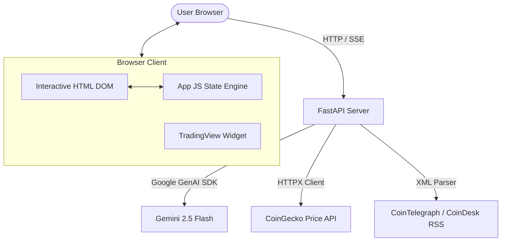

# Crypto AI Advisor: Educational Technical Analysis Dashboard

## 1. Executive Summary & Core Philosophy

**Crypto AI Advisor** is an educational, distraction-free cryptocurrency market dashboard combined with an intelligent AI tutor. The project was designed and built to address a major gap in the modern Web3 and trading space: the lack of clear, educational, and safe tools for beginners looking to understand market dynamics and technical analysis.

### The Problem with Existing Platforms
1. **Bloated & Distracting Interfaces**: Most popular trading terminals and exchanges are filled with distracting ads, paid banners, and complex, cluttered charts that overwhelm newcomers.
2. **Dry, Non-Educational AI Helpers**: Standard LLM assistants available on other platforms are typically dry. They either output raw, uninterpreted indicator values ("RSI is 65, MACD is bullish") without explaining *what* they mean, or they attempt to give risky financial recommendations without proper context.
3. **Lack of Interactivity**: There is a disjoint between static charts and conversational assistants. Users have to copy-paste terms or type long explanations.

### The Solution: A Distraction-Free Educational Workspace
This application consolidates all necessary technical tools (TradingView widgets, real-time market stats, and live RSS news) in one clean, premium workspace. It has:
*   **Zero Advertisements**: Pure focus on learning and analysis.
*   **Educational AI Mentor**: An interactive tutor that explains indicators in simple, intuitive terms, guides strategy formulation, and refuses to give direct investment signals.
*   **Dual-Language Support**: Full Russian and English localization for global accessibility.

---

## 2. Key Features & User Interface

*   **Interactive Multi-Asset Terminal**: Seamlessly switch between major crypto assets (Bitcoin, Ethereum, Solana, Ripple, Dogecoin, etc.).
*   **Live Charts & RSS News**: Integrated TradingView widgets paired with real-time news articles from official feeds (CoinTelegraph, CoinDesk) to connect technical moves with fundamental sentiment.
*   **Polished Quota Monitoring**: An elegant, custom quota status widget showing remaining summary and chat requests with progress tracks and a live countdown to the UTC daily reset.
*   **Click-to-Learn Technical Terms**: Interactive technical indicator values and AI summary terms are styled as clickable elements. Clicking them automatically triggers the AI chat agent to explain that specific indicator or pattern in simple, educational terms.
*   **Clean Startup States**: Automatically clears obsolete browser caches on boot, ensuring a fresh local session free of mixed-language or corrupted histories.

---

## 3. Implemented Kaggle Course Concepts & Security Best Practices

To build a reliable, secure, and production-ready agent, we implemented several advanced security principles and guardrails taught in the course:

### A. Context Confinement (Scope Locking)
The AI agent is strictly confined to the currently selected coin context. If a user tries to query the agent about Ethereum while on the Bitcoin dashboard, the system intercepts the query and politely redirects the user to switch the active coin in the side panel. This prevents off-topic discussions, cross-contamination of token histories, and limits LLM hallucination.

### B. Session Isolation
Each cryptocurrency has its own independent chat history. Chat histories are cached separately in browser localStorage. This guarantees that technical analysis contexts for different tokens remain clean and isolated.

### C. Prompt Shield & Jailbreak Protection
We implemented a robust input validation filter in the backend (`is_query_safe` function). This shield uses regular expressions to inspect incoming queries and blocks:
*   Jailbreak prompts (e.g., "ignore previous instructions", "bypass constraints").
*   System prompt exposure attempts.
*   Command injection risks (e.g., shell executions, `sudo`, file deletions).
*   Requests forcing direct buy/sell advice.
Blocked requests are intercepted before reaching the LLM, returning a secure refusal notice.

### D. Financial Guardrails
The agent operates under strict instructions to act as a *financial educator*, not an investment advisor. If pushed to give buy or sell recommendations (e.g., "Should I buy Bitcoin right now?"), the agent politely refuses, explains the risks of trading, and breaks down the educational parameters of the asset instead.

### E. Credential Leak Prevention (Git Hooks)
To prevent accidentally committing sensitive files (like `.env` with API keys) to public repositories, we created a custom local pre-commit hook (`git_secret_scanner.py`). The hook automatically scans staged changes (`git diff --cached`) for patterns representing Google API Studio keys, GCP Project IDs, and sensitive filenames, blocking the commit if secrets are detected.

---

## 4. Technical Architecture & Technology Stack

The application is engineered as a lightweight, fast, and modern web service:

### Backend
*   **FastAPI**: Provides high-performance, asynchronous REST and Server-Sent Events (SSE) endpoints.
*   **Google GenAI SDK**: Interfaces directly with the `gemini-2.5-flash` model for generating summaries and streaming conversational chat.
*   **HTTPX**: Executes non-blocking API calls to fetch live coin metrics.
*   **APICache**: A custom in-memory caching layer with TTL (Time-To-Live) controls to prevent exceeding CoinGecko and RSS feed request rate limits.

### Frontend
*   **Vanilla HTML & CSS**: Styled with a dark-mode Glassmorphism design using CSS variables, custom progress bars, and custom scrollbars.
*   **Vanilla JS**: Handles responsive sidebar layouts, theme changes, localized text updates, TradingView widget updates, and handles SSE streams.

### Deployment & CI/CD
*   **Docker**: Fully containerized using a clean, single-stage Dockerfile designed for compatibility with Linux builds.
*   **Google Cloud Build**: Compiles code changes directly in the cloud.
*   **Google Cloud Run**: Hosts the application server on managed, autoscaling infrastructure.

---

## 5. Conclusion & Project Value

The **Crypto AI Advisor** is more than just a trading terminal; it is a personalized learning workspace. By removing the commercial noise of traditional exchanges, creating a seamless connection between live charts and conversational learning, and wrapping the AI agent in strict safety and educational guardrails, the project offers a secure sandbox where anyone can learn the art of technical analysis.
