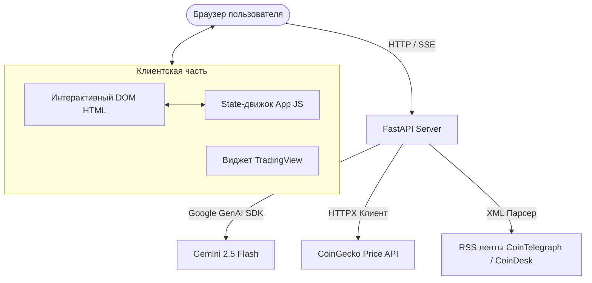

# Crypto AI Advisor: Образовательный дашборд технического анализа

## 1. Краткий обзор и основная философия

**Crypto AI Advisor** — это образовательный, свободный от рекламы криптовалютный рыночный дашборд, объединенный с интеллектуальным ИИ-наставником. Проект был разработан для решения серьезной проблемы в современном Web3 и трейдинг-пространстве: отсутствия понятных, образовательных и безопасных инструментов для новичков, желающих разобраться в динамике рынка и техническом анализе.

### Проблемы существующих платформ
1. **Перегруженные интерфейсы**: Большинство популярных торговых терминалов и бирж заполнены отвлекающей рекламой, платными баннерами и сложными графиками, которые дезориентируют новичков.
2. **Сухие ИИ-помощники без образовательной составляющей**: Стандартные ИИ-ассистенты на других платформах обычно выдают сухие, неинтерпретируемые значения индикаторов (например: «RSI равен 65, MACD бычий») без объяснения того, *что* это значит, либо пытаются давать опасные финансовые советы без должного контекста.
3. **Отсутствие интерактивности**: Существует разрыв между статическими графиками и диалоговыми ассистентами. Пользователям приходится вручную копировать термины или писать длинные объяснения.

### Решение: Образовательное рабочее пространство без лишнего шума
Это приложение объединяет все необходимые технические инструменты (виджеты TradingView, рыночную статистику в реальном времени и живые RSS-новости) в едином лаконичном интерфейсе. Проект предлагает:
*   **Полное отсутствие рекламы**: Чистый фокус на обучении и анализе.
*   **ИИ-наставник с акцентом на обучение**: Интерактивный тьютор, который объясняет индикаторы простыми словами, помогает формулировать стратегии и категорически отказывается давать прямые торговые сигналы.
*   **Поддержка двух языков**: Полная локализация на русский и английский языки для удобства пользователей по всему миру.

---

## 2. Ключевые функции и пользовательский интерфейс

*   **Интерактивный мультивалютный терминал**: Быстрое переключение между основными криптовалютами (Bitcoin, Ethereum, Solana, Ripple, Dogecoin и др.).
*   **Живые графики и RSS-новости**: Интегрированные интерактивные графики TradingView в связке с актуальными статьями из авторитетных источников (CoinTelegraph, CoinDesk) для сопоставления технического анализа с новостным фоном.
*   **Удобный мониторинг квот**: Элегантный виджет квот в панели чата, показывающий количество оставшихся запросов на генерацию сводок и сообщений с цветовыми индикаторами и обратным отсчетом до сброса лимитов по UTC.
*   **Интерактивные термины технического анализа**: Значения технических индикаторов и сложные термины в тексте ИИ-сводки оформлены в виде кликабельных ссылок. Нажатие на любой термин автоматически заставляет ИИ-ассистента объяснить его простыми словами в контексте выбранной монеты.
*   **Чистые стартовые сессии**: Приложение автоматически очищает устаревший локальный кэш браузера при запуске, исключая возникновение смешанных языковых состояний или поврежденной истории.

---

## 3. Примененные концепции курса Kaggle и лучшие практики безопасности

Для создания надежного, безопасного и готового к реальной эксплуатации агента мы внедрили несколько ключевых механизмов защиты, изученных в рамках курса:

### А. Ограничение контекста (Scope Locking / Confinement)
ИИ-агент строго привязан к текущей выбранной криптовалюте. Если пользователь попытается спросить агента про Ethereum, находясь на панели Bitcoin, система перехватит запрос и вежливо перенаправит пользователя переключить монету на левой панели. Это предотвращает обсуждение посторонних тем, путаницу в контекстах и снижает риск галлюцинаций модели.

### Б. Изоляция сессий (Session Isolation)
Каждая криптовалюта имеет свою независимую историю переписки. История чатов кэшируется отдельно в LocalStorage браузера. Это гарантирует, что контекст анализа различных токенов остается чистым и изолированным друг от друга.

### В. Защита от инъекций промптов (Prompt Shield & Jailbreak Protection)
Мы внедрили надежный фильтр валидации входящих запросов на бэкенде (функция `is_query_safe`). Этот щит проверяет входящие сообщения с помощью регулярных выражений и блокирует:
*   Попытки обхода инструкций (например, «игнорируй предыдущие правила», «забудь ограничения»).
*   Попытки раскрыть системный промпт.
*   Угрозы командных инъекций (запуски скриптов, команд `sudo`, удаление файлов).
*   Запросы, принуждающие выдать прямой совет по покупке/продаже.
Подозрительные запросы отсекаются до отправки в модель, возвращая пользователю безопасное сообщение об отказе в обработке.

### Г. Финансовые ограничения (Financial Guardrails)
Агент работает строго в роли *финансового преподавателя*, а не инвестиционного консультанта. При попытках пользователя получить прямой совет по сделке (например, «Стоит ли мне сейчас купить Bitcoin?»), агент вежливо отказывается, предупреждает о рисках торговли и переводит диалог в русло образовательного разбора текущих рыночных индикаторов.

### Д. Предотвращение утечки ключей (Git Hooks)
Чтобы исключить случайную отправку файлов конфигурации (таких как `.env` с ключами API) в публичные репозитории GitHub, мы создали скрипт pre-commit хука (`git_secret_scanner.py`). Хук автоматически сканирует индексируемые изменения перед коммитом на наличие ключей Google API Studio, ID проектов Google Cloud и критических файлов, блокируя коммит при обнаружении чувствительных данных.

---

## 4. Техническая архитектура и стек технологий

Приложение построено как легковесный, быстрый и отзывчивый веб-сервис:

### Бэкенд
*   **FastAPI**: Обеспечивает высокую скорость работы, асинхронную обработку запросов и поддержку Server-Sent Events (SSE) для стриминга ответов чата.
*   **Google GenAI SDK**: Напрямую взаимодействует с моделью `gemini-2.5-flash` для генерации ответов и саммари.
*   **HTTPX**: Выполняет неблокирующие запросы для получения актуальных цен.
*   **APICache**: Собственный кэш в оперативной памяти с контролем времени жизни (TTL) для предотвращения превышения лимитов запросов к CoinGecko и RSS-лентам.

### Фронтенд
*   **Ванильный HTML и CSS**: Реализован в современном темном дизайне Glassmorphism с использованием CSS-переменных, кастомных прогресс-баров и плавной анимации элементов.
*   **Ванильный JS**: Отвечает за реактивность интерфейса, смену тем оформления, переключение языков, обновление графиков TradingView и разбор входящего SSE-потока.

### Деплоймент и CI/CD
*   **Docker**: Полная контейнеризация проекта для запуска в изолированной среде Linux.
*   **Google Cloud Build**: Облачная компиляция и сборка Docker-образа.
*   **Google Cloud Run**: Хостинг приложения на масштабируемой бессерверной инфраструктуре.

---

## 5. Заключение и ценность проекта

Проект **Crypto AI Advisor** — это не просто торговый терминал, а персональный класс для обучения. Убирая коммерческий шум и рекламу традиционных платформ, создавая бесшовную связь между рыночными графиками и интерактивным диалогом с ИИ, а также защищая пользователя надежными рамками безопасности, проект предоставляет безопасную песочницу, в которой каждый может освоить азы технического анализа.
